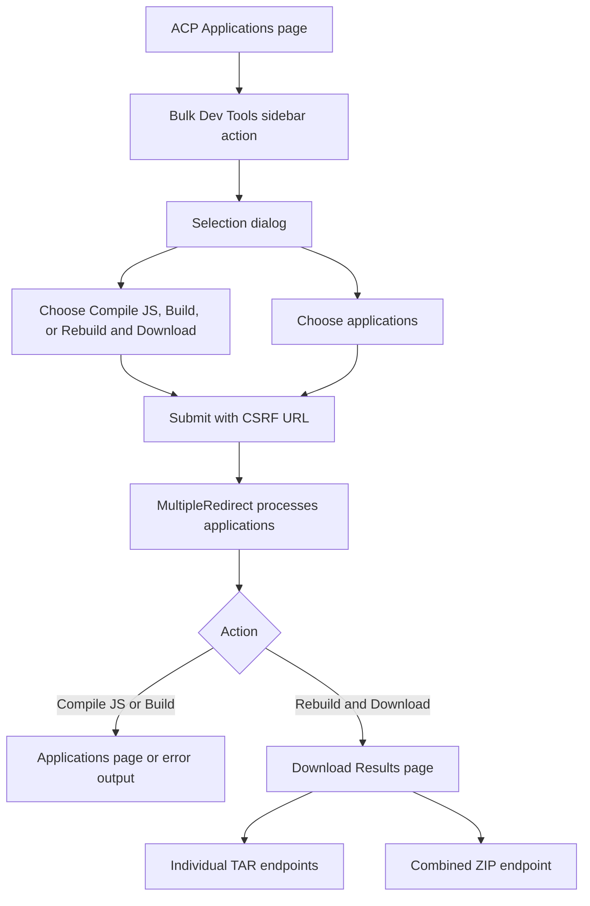
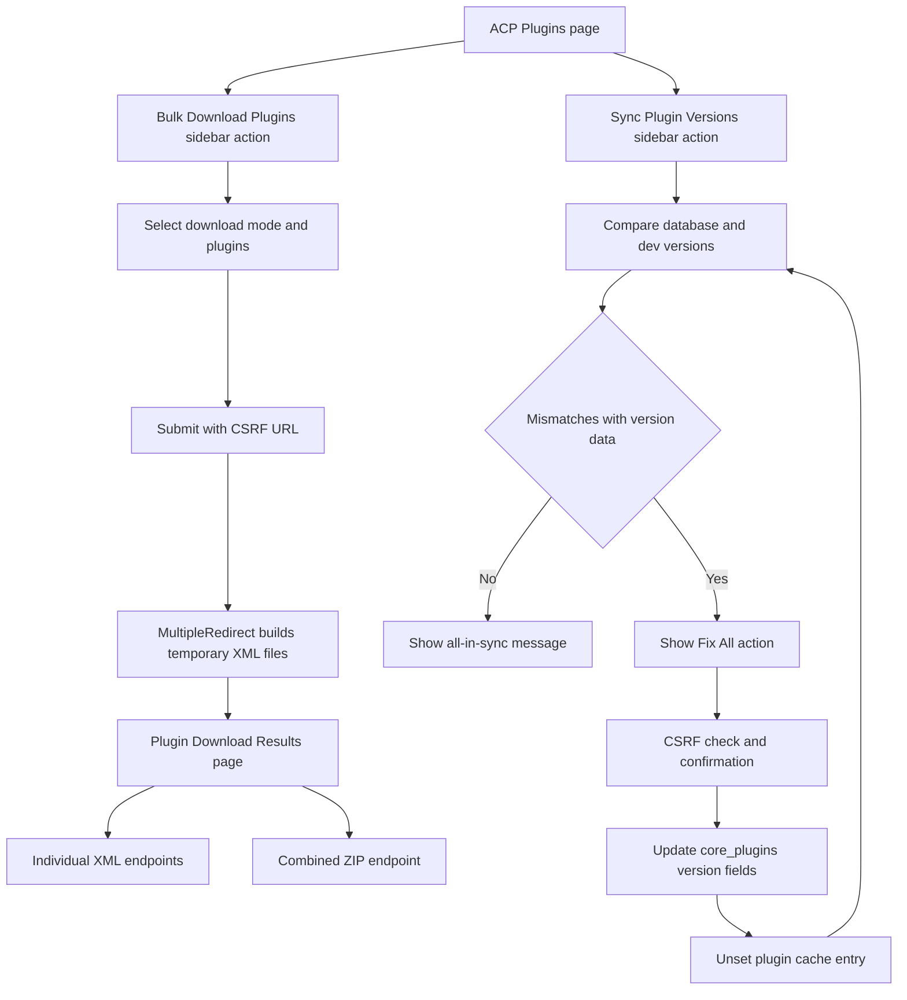

# Flow: X Bulk Dev Tools

## Applications Flow

## Plugins Flow

## Applications Processing Sequence

1. Form submission stores `xbdt_apps` and `xbdt_download_mode` in the session.
2. The controller redirects to `xbdtProcess&action={action}` with a CSRF key.
3. The first `MultipleRedirect` call reads the selection and initializes its data array.
4. Each step loads one application. `build` and `download` call `$application->build()`. `compilejs` creates JavaScript XML, writes it when the application data directory is writable, compiles the application, and also compiles `global` for `core`.
5. Each step catches `\Exception`, records the message, increments the index, and returns progress.
6. The final step stores errors and the selected application keys in the session.
7. The finished callback sends `download` to the results page. For the other actions it clears batch session state, emits an error when any item failed, or redirects to the Applications page with a completion message.
8. An individual TAR endpoint builds an archive with `\IPS\Application\BuilderIterator`, sends it, and removes the temporary archive. The ZIP endpoint builds one TAR per selected application, adds available TAR files to the ZIP, sends the ZIP, and clears the download session state.

## Plugins Processing Sequence

1. Form submission stores `xbdt_plugin_ids` and `xbdt_plugin_download_mode` in the session.
2. The controller redirects to `xbdtPluginProcess` with a CSRF key.
3. The first `MultipleRedirect` call reads the selection and initializes its data array.
4. Each step loads one plugin, calls `xbdtBuildPluginXml()`, writes the XML to `\IPS\TEMP_DIRECTORY`, records file metadata, and returns progress. Exceptions are recorded without stopping later plugins.
5. The final step stores errors and built-file metadata in the session, then the finished callback redirects to the results page.
6. An individual XML endpoint consumes the temporary file when it exists, or rebuilds the XML when it does not. The ZIP endpoint uses available temporary files and rebuilds missing ones, sends the archive, removes its temporary files, and clears the plugin download session state.
7. When individual mode was selected, the results page starts each XML endpoint in a hidden iframe, with 1.5 seconds between requests.

## Sync Plugin Versions Sequence

1. The direct Sync Plugin Versions action calls `xbdtSyncPluginVersions()` without a dialog.
2. The method iterates all plugins. For each existing, nonempty `dev/versions.json`, it uses the highest key as the development long version and the mapped value as the human version.
3. It compares both development values with `version_long` and `version_human` from the loaded plugin record.
4. The page shows database and development versions plus an in-sync, out-of-sync, or unknown status. A missing or empty versions file is unknown and does not enable the fix action.
5. When at least one comparable plugin is out of sync, the page shows a confirmed, CSRF-protected Fix All action.
6. The fix action updates both version fields in `core_plugins` for each mismatch, skips missing or empty version data, unsets `\IPS\Data\Cache::i()->plugins`, and redirects to the comparison page.

## Error Handling

- Each batch item catches `\Exception` and appends its message to the `errors` array.
- Application build and compile errors are emitted after the queue completes. Download errors are rendered on the applicable results page.
- Processing continues with the next selected item after an item exception.
